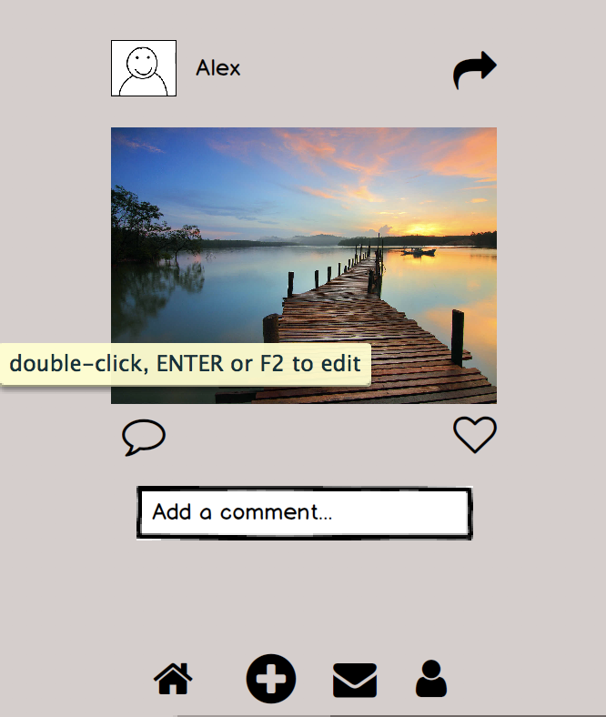
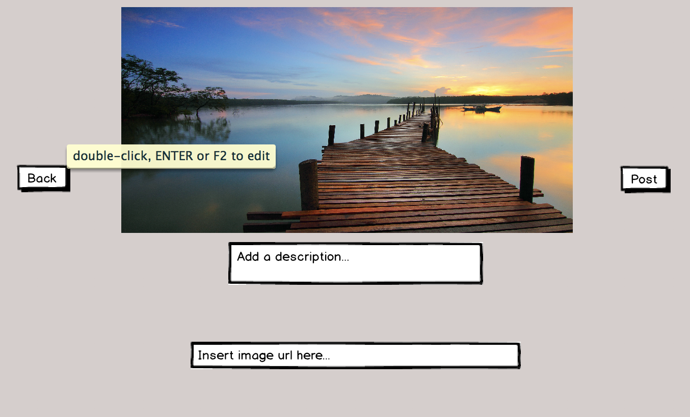

# Instagram-Lite
Project 2 CRUD app

##This app is based off Instagram. It's a more lightweight version in terms of functionality. Some of the features it includes is viewing all posts, creating a post, editing a post, and deleting a post. Also included is a share button to all the major social media apps and a front-end Javascript "like" button.

##To get started I ran the following commands in the terminal:
###These commands installed the database I created.
'psql -f db/schema.sql'
'psql -f db/seed.sql'

##I then ran:
###These commands initialized the app and installed node modules.
###Note: Install Node.js https://nodejs.org/en/

'npm init'

'npm install --save express'

'npm install --save ejs'

'npm install --save pg-promise bluebird pg-monitor'

'npm install --save moment' (moment allows you to manipulate the date and time based on preference)

'npm install --save methodoverride'

##Wireframes

##The following code was my favorite part of the entire project.
###This code adds the functionality to take a pasted url and instantly append it to the DOM.

  $('#photo-url').bind('input paste', function () {
      const image = $('#photo-url').val()
      $('#new-image').append(``)
    })

##Future additions.
###There are a few features I would like to add in the future to make it more functional. Some of these features are:

1) User authentication - currently all the users are hard coded into the database so there isn't a sign-up/sign-in feature.

2) Profile view - after incorporating user authentication, having a profile page for each user.

3) Comments - having the ability to comment on a post.

4) Changing the "like" button from front-end javascript to back-end javascript so it can be stored in the database.

5) Adding video compability to posts.

